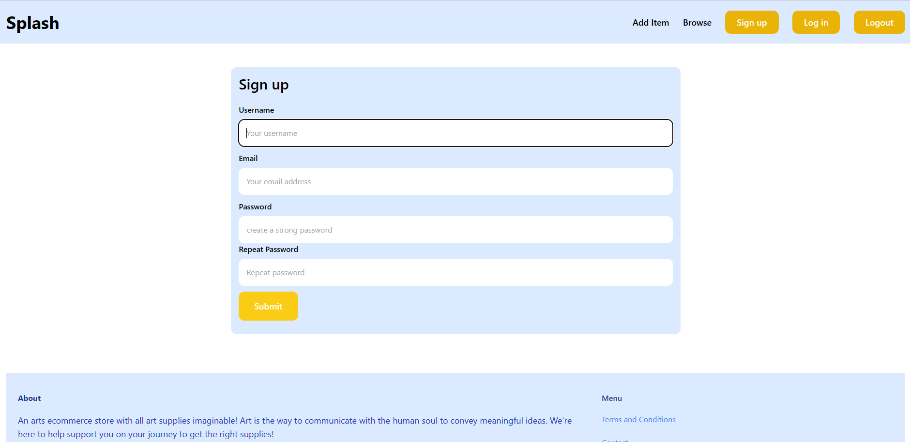
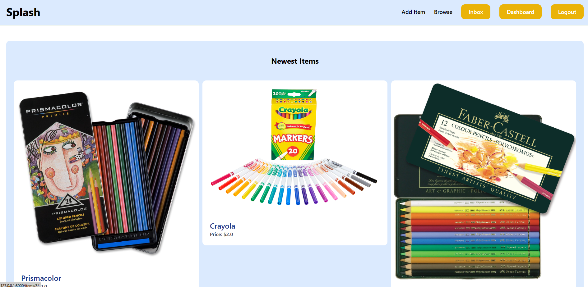

## Django Art Store

Welcome to the Django art store! This is an ecommerce website designed for artists who seek to purchase supplies for their work. This website comes with user authentication, user login and registration, and conversations as well. However, the conversations is not built using sockets; it's built by conditionals and loops. 
Users have options to browse (which shows categories), they can add items and delete those items as well. 

# Images 
 

## Use 
To use this app users must sign up. Users who are logged in can view their messages and post their own products to sell. 
